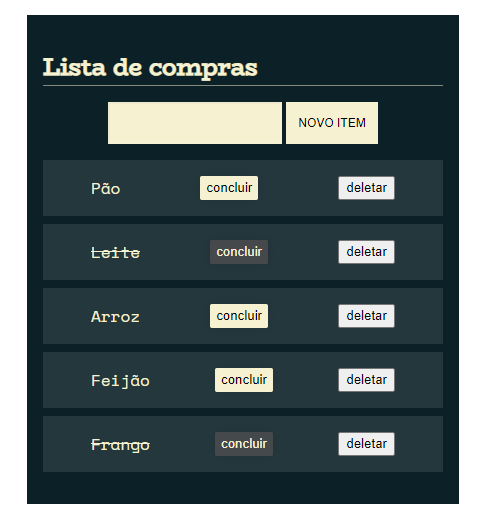

# Lista de compras

Projeto feito pra o usuario criar uma lista de compras, com as funções de adicionar, riscar ou remover itens já listados.

___
## Motivação

Projeto para fins de estudo, aprendizagem e prática em JavaScript, CSS e HTML.

___
## Tecnologias utilizadas

- JavaScript
- HTML 
- CSS
- Visual Studio Code

___
## Autor

- Douglas Andrade dos Santos